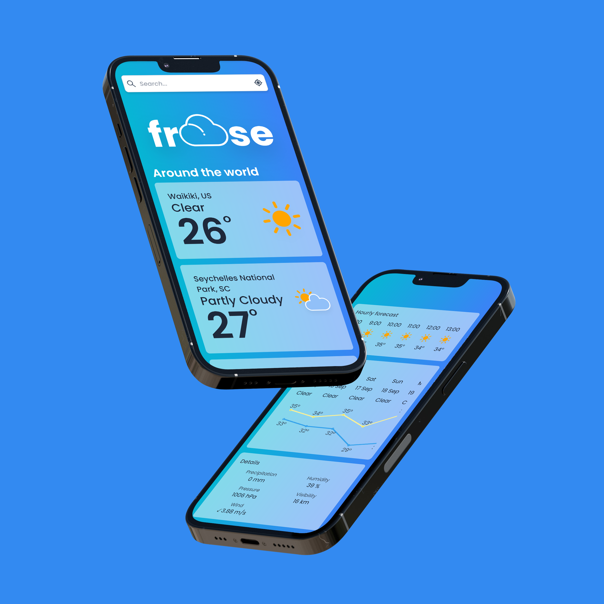

<div align="center">

  
  <h1>Froose</h1>
  
  <p>
    An awesome Weather app! 
  </p>

<p>
  <a href="">
    
  </a>
  <a href="https://github.com/maciekzygmunt/froose/stargazers">
    
  </a>
  <a href="https://github.com/maciekzygmunt/froose/blob/master/LICENSE">
    
  </a>
</p>
   
<h4>
    <a href="https://froose.vercel.app/">View Demo</a>
  <span> · </span>
    <a href="https://github.com/maciekzygmunt/froose">Documentation</a>
  <span> · </span>
    <a href="https://github.com/maciekzygmunt/froose/issues/">Report Bug</a>
  <span> · </span>
    <a href="https://github.com/maciekzygmunt/froose/issues/">Request Feature</a>
  </h4>
</div>

<br />

<!-- Table of Contents -->

# :notebook_with_decorative_cover: Table of Contents

- [About the Project](#star2-about-the-project)
  - [Screenshots](#camera-screenshots)
  - [Tech Stack](#space_invader-tech-stack)
  - [Features](#dart-features)
  - [Color Reference](#art-color-reference)
  - [Environment Variables](#key-environment-variables)
- [Getting Started](#toolbox-getting-started)
  - [Run Locally](#running-run-locally)
- [Contact](#handshake-contact)
- [Acknowledgements](#gem-acknowledgements)

<!-- About the Project -->

## :star2: About the Project

<!-- Screenshots -->

### :camera: Screenshots

<div align="center"> 
  
</div>

<!-- TechStack -->

### :space_invader: Tech Stack

<details>
  <summary>Client</summary>
  <ul>
    <li><a href="https://www.typescriptlang.org/">Typescript</a></li>
    <li><a href="https://nextjs.org/">Next.js</a></li>
    <li><a href="https://tailwindcss.com/">TailwindCSS</a></li>
  </ul>
</details>

<!-- Features -->

### :dart: Features

- Check weather for a given location
- Add locations to favorites
- Change time format(12h/24h) and units(metric/imperial)

<!-- Color Reference -->

### :art: Color Reference

| Color           | Hex                                                                  |
| --------------- | -------------------------------------------------------------------- |
| Primary Color   |  #3B82F6 |
| Secondary Color |  #06B6D4 |
| Text Color      |  #1e293b |

<!-- Env Variables -->

### :key: Environment Variables

To run this project, you will need to add the following environment variables to your .env file

`NEXT_PUBLIC_WEATHER_KEY` - api key from [tommorow.io](https://www.tomorrow.io/)  
`NEXT_PUBLIC_GEOCODER_KEY` - api key from [tomtom.com](https://developer.tomtom.com/)  
`NEXT_PUBLIC_DEV_MODE` - use `true` when developing to not spam api

<!-- Getting Started -->

## :toolbox: Getting Started

<!-- Prerequisites -->

### :running: Run Locally

Clone the project

```bash
  git clone https://github.com/maciekzygmunt/froose.git
```

Go to the project directory

```bash
  cd froose
```

Install dependencies

```bash
  npm install
```

Start the server

```bash
  npm run dev
```

<!-- Contact -->

## :handshake: Contact

Maciej Zygmunt - maciekzygmunt@interia.pl

Project Link: [https://github.com/maciekzygmunt/froose](https://github.com/maciekzygmunt/froose)

<!-- Acknowledgments -->

## :gem: Acknowledgements

Useful resources and libraries that I have used in my project.

- [Icons](https://www.amcharts.com/free-animated-svg-weather-icons/)
- [Chart.js](https://www.chartjs.org/)
- [React Easy Marquee](https://github.com/jagnani73/react-easy-marquee)
- [React Hot Toast](https://react-hot-toast.com/)
- [React Indiana Drag Scroll](https://github.com/norserium/react-indiana-drag-scroll)
- [React Icons](https://react-icons.github.io/react-icons/)
- [Awesome README template](https://github.com/Louis3797/awesome-readme-template)
